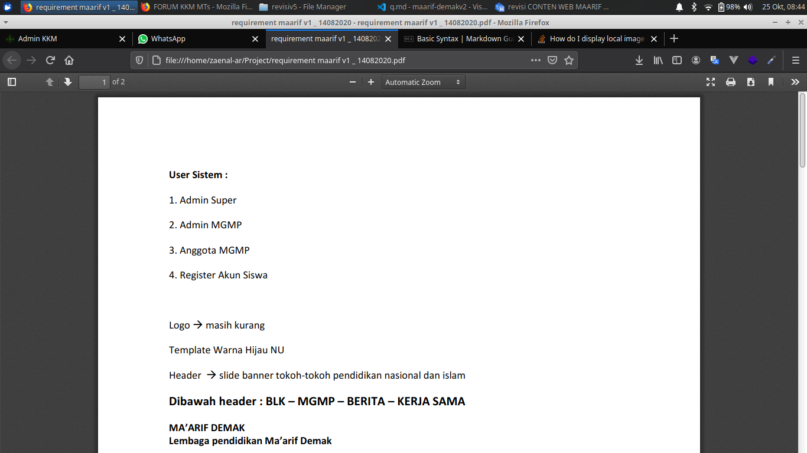
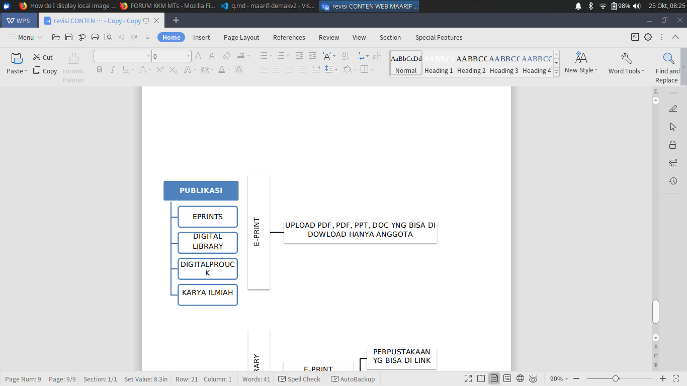
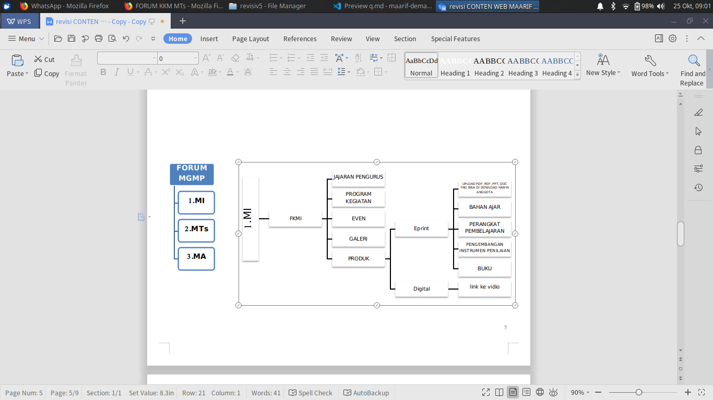
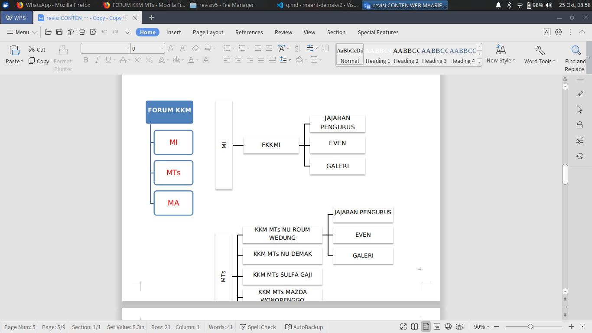

==== PERTANYAAN =====

1. Apakah User siswa masih dipertahankan untuk bisa melihat bagian menu **publikasi**
    
    

    

   * [ ] Kalau Sesuai Dengan Kriteria Diatas (mungkin) jawabanya siswa hanya melihat 3 bagian itu 
  
2. Anggota KKM
    * [ ] di dokumen tidak ada kata2 **anggota kkm**
    * [ ] dan kalau jika dibandingkan dengan **Anggota MGMP**, Anggota mgmp hanya bisa **melihat** => produk **eprint**, sedangkan Forum KKM **tidak ada produk eprint** 
    * [ ] terus pertanyaannya bisa melihat apakah **anggota kkm** ?

    

**PERTANYAAN SAYA**
* [ ] apakah saya melanjutkan user siswa dan  bisa mengakses bagian **publikasi** 
* [ ] apakah masih tetap ditambahkan **anggota kkm** ? kemudian anggota kkm **bisa mengakses** apa aja?
  